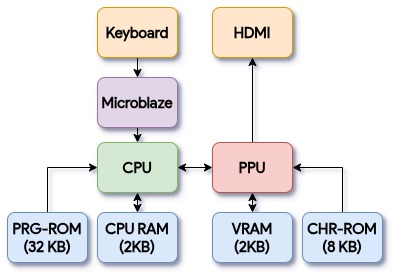
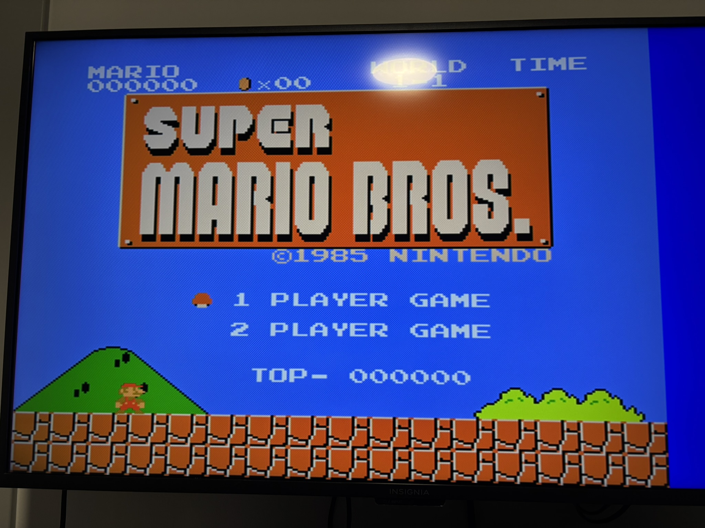
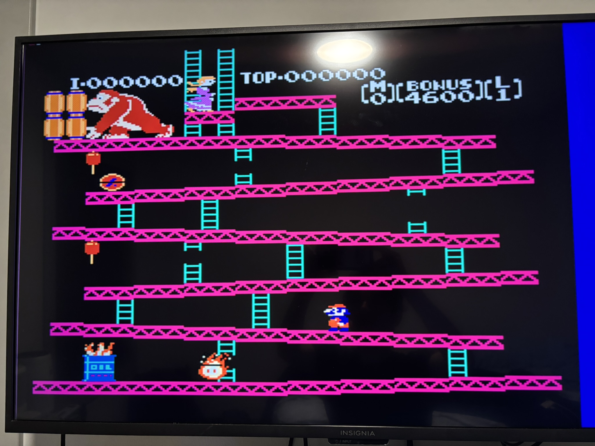

# NES Emulator on FPGA

This project implements a Nintendo Entertainment System (NES) emulator on an FPGA. It has been tested on the Urbana board developed by Real Digital and verified with *Super Mario Bros.* and *Donkey Kong*. The system is built around an open-source [6502 CPU](https://github.com/mist-devel/T65).

A graphics pipeline interprets and renders background and sprite data stored in CHR ROM, closely emulating the NES Picture Processing Unit (PPU). Video output is provided through a VGA-to-HDMI conversion module supporting 640×480 resolution at 60 Hz. Since the NES native resolution is 256×240 (scaled to 512×480), the display includes blank padding areas.

A script is also included that extracts the program and character ROMs from `.nes` files. As of now, these need to be manually loaded into block RAM and the bitstream needs to be regenerated.
## System Overview

## Example Gameplay

### Super Mario Bros.  

### Donkey Kong  

## Playing on the emulator
After building and running, the keyboard will start working after a few seconds and the game can be played normally.
The keys are as follows, WASD for directions, 
y: A, h: B, c: Select, v:Start.

## Implementation Notes

- **Clock speeds**: CPU clocked at 10 MHz, PPU effectively at 25 MHz to match VGA pixel clock. Frame rate remains 60 Hz with synchronization via VBlank signal.
- **VBlank timing**: Adjusted to align with VGA timing (lines 482–500) to prevent multiple NES frames within a single VGA frame.
- **Input**: MicroBlaze processor maps USB keyboard keycodes into an 8-bit register read by the CPU for controller input.

## Future Work

- Write 6502 from scratch
- Fix Sprite 0 hit detection at higher resolutions.
- Streamline game loading without full bitstream regeneration.
- Add audio emulation.
- Implement 8×16 sprite support.